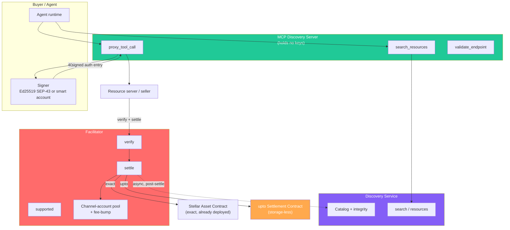
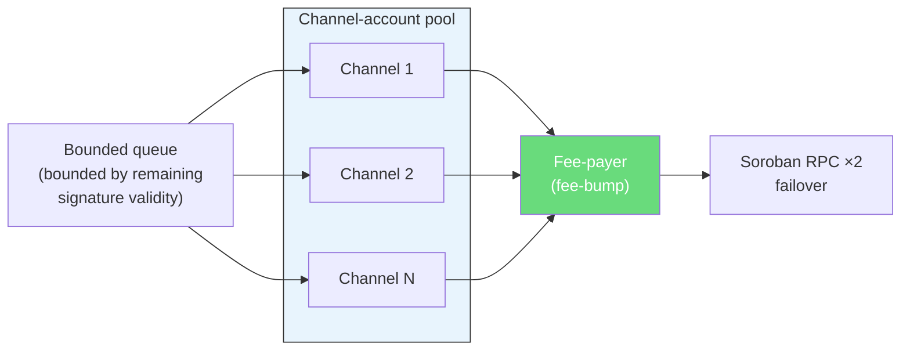
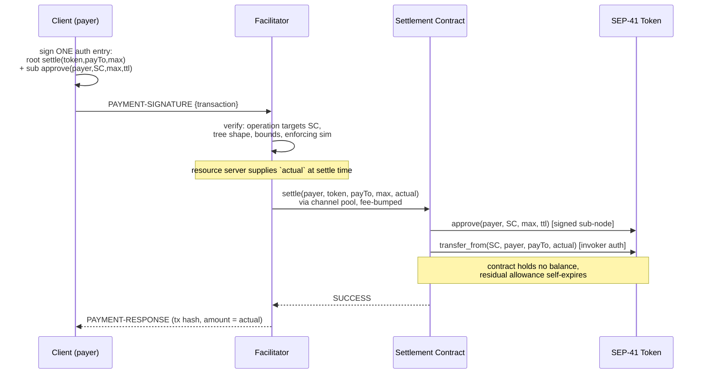
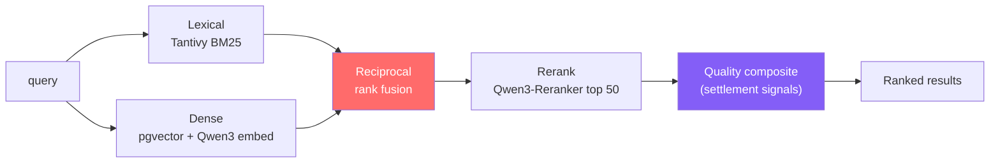
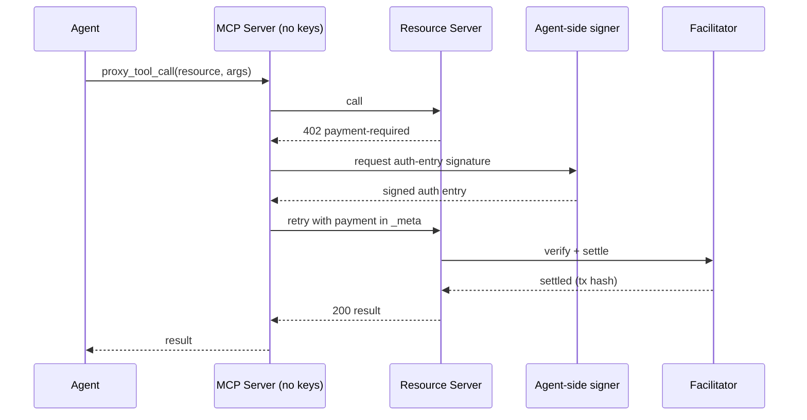
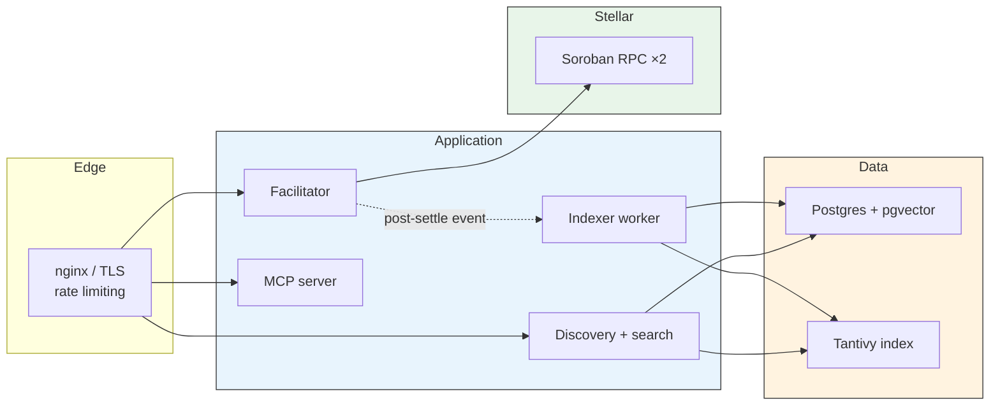

# 1ly x402 Facilitator and Bazaar for Stellar: Technical Architecture

---

## 1. Introduction

### 1.1 High-Level Overview

1ly is an x402 payment facilitator and a native Bazaar discovery layer for Stellar. It lets any service charge software clients per request, and it lets agents find, price, and pay for those services without a prior integration. Both run under a permissive license, so the same codebase serves as a managed hosted provider and as a fork anyone self-hosts.

x402 turns HTTP 402 into a machine-native payment flow. A client requests a resource, the server answers 402 with terms, the client signs a payment authorization and retries, and a facilitator verifies and settles on-chain before the resource is returned. The buyer is software, usually an agent paying per request with no account and no API key.

Stellar fits this well. A settlement costs a fraction of a cent in XLM, which is what makes per-request micropayments viable. USDC and other stablecoins are first-class assets reachable from Soroban through the Stellar Asset Contract. Settlement uses Soroban's authorization model: the client signs an auth entry permitting a specific contract call, and the facilitator submits it and covers the fee.

The protocol comprises:

- A **facilitator service** that exposes the standard x402 surface (`verify`, `settle`, `supported`) for both the `exact` and `upto` schemes, on `stellar:testnet` and `stellar:pubnet`.
- A **discovery service** that catalogs every paid resource automatically at settlement time and answers `GET /discovery/resources` and `GET /discovery/search`.
- A **search engine** that ranks resources by hybrid retrieval plus a quality composite derived from real settlement activity.
- An **MCP discovery server** that runs the discover, pay, retry loop inside an agent runtime and holds no keys.
- One **Soroban settlement contract**, used only by the `upto` scheme, that holds no funds and no persistent state.

The facilitator deploys no contract for `exact`. It calls the Stellar Asset Contract that already exists for every asset. The single contract in this system exists only because variable-amount settlement requires it, and section 5 explains why.

### 1.2 Key Terms

| Term | Definition |
| --- | --- |
| **x402** | HTTP-native payment protocol. A 402 response carries payment terms; the client signs and retries |
| **Facilitator** | Service that verifies a signed payment, submits it on-chain, and sponsors the fee |
| **exact** | Scheme that settles a fixed amount known at signing time |
| **upto** | Scheme where the client authorizes a maximum and the server settles the actual usage, up to that cap |
| **Bazaar** | Discovery layer. A machine-readable catalog of paid resources agents can search |
| **Resource** | A paid HTTP endpoint or a paid MCP tool |
| **Auth entry** | A Soroban authorization entry. The client signs the invocation, not the whole transaction |
| **SAC** | Stellar Asset Contract. The built-in contract that moves a Stellar asset |
| **SEP-41** | Stellar token interface. The uniform `transfer` / `approve` / `transfer_from` surface |
| **Channel account** | A source account used only to supply a sequence number, decoupling submission from the authorizing key |
| **strkey** | Stellar address encoding: `G…` for accounts, `C…` for contracts |
| **MCP** | Model Context Protocol. The interface an agent runtime uses to call tools |
| **Soroban RPC** | JSON-RPC endpoint for simulating and submitting Soroban transactions |
| **CAIP-2** | Chain identifier standard. `stellar:pubnet` and `stellar:testnet` name the two networks |

---

## 2. Architecture Overview

### 2.1 The System at a Glance

The facilitator is a validator, a broadcaster, and a fee sponsor. It never holds funds and never appears in a signed authorization. The client signs a Soroban auth entry; the facilitator rebuilds the transaction with a channel account as source, pays the network fee, submits, and returns the result. Funds move from payer to recipient directly through the token contract.

Discovery runs beside settlement, never inside it. When a payment settles and carries the discovery extension, the facilitator emits an event and an indexer catalogs the resource. A discovery outage cannot fail a payment, and a settlement outage leaves the catalog readable.

### 2.2 High-Level Diagram



### 2.3 Architecture Constraints

| # | Constraint | Description |
| --- | --- | --- |
| 1 | **Non-custodial** | The client signs auth entries. The facilitator never holds funds, never pays value, and never appears in any auth entry. The one contract holds no balance and no state |
| 2 | **Tamper-evident** | Every payment parameter is inside the signed preimage. Any change to amount, recipient, or asset invalidates the signature |
| 3 | **Permissive license end to end** | Apache-2.0 project license. No AGPL, no Elastic License, no non-OSI license anywhere in the dependency path, enforced in CI |
| 4 | **Failure-domain isolation** | Cataloging is asynchronous and post-settle. A discovery outage cannot fail a payment |
| 5 | **Built on `@x402/stellar`** | The `exact` scheme reuses the reference package's verify and settle. We do not reimplement solved settlement |
| 6 | **Bounded sponsorship** | Every path where the facilitator pays a fee carries an explicit anti-drain control |
| 7 | **Wire-level conformance** | Acceptance is a stock canonical client completing a payment on both networks, not a claim |
| 8 | **Stellar-only** | Testnet and mainnet, deployed via `stellar-cli`; addresses in `deployments/<network>.json` |

---

## 3. Facilitator: the exact scheme

### 3.1 Role

The `exact` scheme settles a fixed amount. The payment is a single `invokeHostFunction` operation calling `transfer(from, to, amount)` on the asset's SAC, carried as a base64 XDR transaction inside the payment payload, plus the client's signed Soroban auth entries. No contract is deployed. The SAC for every Stellar asset already exists on the network.

Wire format is x402 v2: `PAYMENT-REQUIRED` on the 402, `PAYMENT-SIGNATURE` on the paid retry, `PAYMENT-RESPONSE` on settlement. We accept the top-level `x402Version` body field that every reference client sends, even though the specification text omits it, because a facilitator that rejects it is unusable with stock clients.

### 3.2 Verification pipeline

The facilitator inherits the named checks from `@x402/stellar` and keeps them current. Grouped by what they defend:

**Protocol shape.** `x402Version == 2`; scheme `exact` on payload and requirements; network match on a Stellar CAIP-2 identifier; exactly one operation of type `invokeHostFunction`; host function is a contract invocation.

**Sponsorship safety.** The facilitator address is not the transaction source, not the operation source, not the transfer `from`, and appears in no authorization entry. This guard is what makes sponsoring the fee safe.

**Transfer correctness.** Invoked contract equals `requirements.asset`; function is `transfer` with exactly three arguments; `to` equals `requirements.payTo`; `amount` equals `requirements.amount` exactly.

**Authorization integrity.** Entries use address credentials only; the root invocation has no sub-invocations; `signatureExpirationLedger` does not exceed `currentLedger + ceil(maxTimeoutSeconds / estimatedLedgerSeconds)` plus a small tolerance; the payer has signed and no other signatures are pending. The signature covers the SHA-256 of the `ENVELOPE_TYPE_SOROBAN_AUTHORIZATION` preimage, which binds the network, nonce, expiration, and the exact invocation. Any mutation of recipient, amount, asset, or call shape invalidates it.

**Replay.** The Soroban host consumes the auth-entry nonce, checks for prior existence, and keeps the entry in the ledger until the signature expires. Replay protection is a protocol property. The facilitator keeps no replay authority of its own.

**Simulation.** Re-simulation runs in enforcing mode before any verify result. Recording mode does not execute `require_auth`, does not validate signatures, and underestimates resources, so it is never the basis for verification. The simulated fee must stay within a configurable ceiling, and the simulated events must show exactly one token transfer matching from, to, amount, and asset, with no other balance change.

Every failed check returns a distinct error code with a non-null reason.

### 3.3 Two reference defects we fix upstream

**Muxed recipient.** The current SAC `transfer` takes the recipient as a `MuxedAddress`. The reference validator reads it with `scValToNative(...) as string` and compares against `payTo` as a plain address, so a muxed destination is not handled cleanly. Our validator decodes and compares against the real signature and handles the muxed case. We contribute the fix upstream.

**Amount range by recipient type.** Classic trustline balances are a signed 64-bit integer even though the interface accepts 128-bit. Contract balances are 128-bit. We validate the amount against the bound of the resolved recipient type, with a specific error code, rather than rejecting flatly or failing at submission.

### 3.4 Assets, trustlines, decimals

Any SEP-41 token, with USDC as the default. Classic assets settle through their SAC instance; contract tokens settle through the same interface. Amounts are atomic-unit strings and all arithmetic is integer. USDC on Stellar uses 7 decimals.

A G-account needs a trustline before it can receive a non-native asset. As of Protocol 26, the SAC `trust` function creates the trustline in-invocation, a no-op for contract addresses and existing trustlines, requiring the holder's authorization when actually created. Seller onboarding covers the trustline step and buyer helpers include a trustline preflight that reports whether a payment will succeed before a signature is spent.

### 3.5 Settlement

On a valid verify, the facilitator rebuilds the transaction with a channel account as source, copies the operation and the auth entries, sets the fee from enforcing simulation, refreshes Soroban resource data, signs the envelope, wraps it in a fee-bump, submits, and polls to success or failure. Funds move payer to recipient directly. The response carries the transaction hash and the payer address. `/supported` advertises the Stellar `extra` contract including `areFeesSponsored`, read from configuration so the value stays correct when the upstream non-sponsored flow lands.

---

## 4. Throughput

Stellar serializes transactions per source account by sequence number, which caps a single account near one transaction per ledger. Agent traffic is bursty, so the facilitator uses a pool of channel accounts.

Channel accounts are the throughput mechanism. Fee-bump is complementary, not a substitute: a fee-bump lets a separate account pay the fee, but the sequence number still comes from the inner source, so fee-bump alone raises nothing.



The pool holds N zero-balance, reserve-sponsored channel accounts, round-robin selected as the settlement source, each settlement fee-bumped from one funded fee-payer. Creation, funding, health, and refund are scripted, following SDF's own channel-account tooling. A channel whose sequence has drifted after a submission of uncertain outcome is quarantined and reconciled, never reused blind. N is sized from target settlements per second times observed ledger close time.

The queue is bounded by remaining signature validity, not only by depth. Auth entries live roughly 12 to 60 ledgers. Holding a request past its expiry window consumes capacity to produce a guaranteed failure, so a request that cannot be submitted inside its validity window is rejected immediately with a retryable code and a `Retry-After` hint.

`upto` settlements ride the same pool.

---

## 5. Settlement schemes

### 5.1 exact

Contract-free. It reuses the SEP-41 token and its SAC, the same pattern EVM uses with EIP-3009 and Solana uses with a native SPL transfer. Nothing is deployed, which is why the mainnet launch ships no new contract and the mainnet production tag rests on the off-chain service review.

### 5.2 upto: why it needs a contract

The `upto` scheme lets a service advertise a maximum, then settle the actual usage. Metered billing, such as LLM tokens, needs this.

On Stellar it requires a contract, and the reason is structural. A Soroban auth entry commits to the exact invocation arguments, and the amount is one of those arguments. A client that signs a direct `transfer` has signed a fixed amount. A smart-account policy can cap or reject an already-fixed invocation but cannot make the signed amount variable. The only contract-free variable-amount path is a raw SEP-41 allowance, where the spender chooses the recipient and the residual allowance is drawable again. That path fails two of the scheme's mandatory properties, recipient binding and single settlement, which is why the protocol rules it out. The only existing precedent, the EVM implementation, ships a dedicated proxy contract for the same reason.

So `upto` ships one contract. It is single-function, holds no balance, and stores nothing.

### 5.3 The upto settlement contract

The client signs one authorization whose amount field is the maximum, not the settled value. The contract achieves this with `require_auth_for_args`, which authorizes a chosen subset of arguments rather than the full invocation. The signed argument list is `(token, payTo, max)`. The settled `actual` is supplied at settle time, outside the signature, and bounded by the contract.

```rust
pub fn settle(
    e: Env,
    payer: Address,
    token: Address,
    pay_to: Address,
    max: i128,
    actual: i128,
    live_until_ledger: u32,
) {
    // Root signed args are (token, pay_to, max). `actual` is unsigned and
    // bounded below; `live_until_ledger` is bound by the signed approve sub-node.
    payer.require_auth_for_args((token.clone(), pay_to.clone(), max).into_val(&e));
    if actual < 0 || actual > max {
        panic_with_error!(&e, Error::SettlementExceedsMax);
    }
    let t = token::TokenClient::new(&e, &token);
    // Authorized by the payer's signed sub-invocation node:
    t.approve(&payer, &e.current_contract_address(), &max, &live_until_ledger);
    // Automatic invoker authorization (direct one-level call):
    t.transfer_from(&e.current_contract_address(), &payer, &pay_to, &actual);
}
```

The signed authorization tree, produced from one client signature:

```
root: settle(token, payTo, max)  on the settlement contract
  └─ sub: approve(payer, settlement_contract, max, live_until_ledger)  on the token
```

The contract calls `approve`, and the client's signed sub-invocation authorizes that call. It then calls `transfer_from`, which needs no signature because a direct call by the invoking contract is automatically authorized. The contract never receives a balance. The recipient argument of `transfer_from` is a plain address, so the payout leg avoids the muxed encoding entirely.



**How each mandatory property is met:**

| Property | Mechanism |
| --- | --- |
| Recipient binding | `payTo` is a signed argument. Changing it invalidates the signature |
| Single settlement | The Soroban host consumes the nonce once and keeps it until expiry. Zero contract storage |
| Maximum enforcement | The contract asserts `actual <= max` and the allowance independently caps the draw at `max` |
| Time bound | `signatureExpirationLedger` on the entry and `live_until_ledger` on the allowance, coupled by the validation in 5.5 |
| Zero settlement | Legal; handled in 5.6 |

### 5.4 Why not transfer-and-refund

An alternative signs `transfer(payer, contract, max)` and refunds the remainder. We rejected it because the contract would then hold a balance, which:

1. Breaks any SEP-41 token. A contract receiving a balance of an authorization-required asset must first be authorized by that asset's admin, one approval per asset.
2. Creates a clawback surface. A contract balance is clawback-eligible if the issuer enabled clawback at balance creation.
3. Creates a throughput hotspot. Contract balances live in one contract-data entry per asset, a single hot read-write entry serialized across all payers, which channel accounts cannot parallelize.

The allowance path avoids all three. Allowances are keyed per payer and spender, so contention is per-payer, and the allowance lives in temporary storage that self-expires.

### 5.5 Facilitator validation for upto

This path inverts the `exact` rule that rejects sub-invocations, so it is new security-critical code with its own error codes and tests.

1. **Operation target.** The invoked contract of the operation equals the settlement contract address the facilitator advertises in `/supported`; the function is `settle`; the operation invocation contains nothing else. This is checked on the operation, not the auth entry, because the protocol imposes no requirement that an auth entry's root match the operation's root, and a pass-through router contract is transparent to the signer. Without this check the facilitator would sponsor a call into any contract whose auth shape happens to match.
2. **Auth-tree shape.** Exactly one root node, `settle(token, payTo, max)`. A payload whose root node includes `actual` is rejected. Exactly one sub-invocation, `approve(payer, settlement_contract, max, live_until_ledger)`, spender equal to the settlement contract, `max` equal to the root's `max`. Nothing else in the tree.
3. **Requirements binding.** Root `payTo` equals `requirements.payTo`, token equals `requirements.asset`, and at verify time `max` equals `requirements.amount`.
4. **Temporal coupling.** `live_until_ledger <= signatureExpirationLedger`. The residual-allowance argument depends on this. Own error code, own test.
5. **Settle-time re-verification.** `actual <= max` where `max` comes from the signed authorization, and the signature is re-verified against the signed `max`, never against the settle-time amount. This is the most commonly mishandled part of the scheme.
6. **Fee ceiling.** The enforcing-simulation fee stays within the upto-specific ceiling.

### 5.6 Residual allowance, concurrency, zero settlement

**Residual.** After settlement, `max - actual` allowance remains until `live_until_ledger`, spendable only by the settlement contract, which cannot spend it without a fresh client signature carrying a fresh nonce. The residue is double-bounded: unreachable without a new signature, and self-expiring in temporary storage.

**Concurrency.** `approve` sets rather than increments. Within one invocation, set-then-consume is atomic, so there is no exploit window. Concurrent settles from one payer overwrite each other's residue, which is documented and tested.

**Zero settlement.** When `actual` is zero, no transaction is submitted and the authorization expires unused, matching the EVM precedent. Submitting a transaction on zero would let a resource server trigger sponsored-fee spend for free, so the facilitator discards the payload instead.

### 5.7 Composition with spending policies

A buyer's smart account sees the full authorization tree, including `max`, `payTo`, and the token, so an account policy can enforce a per-window cumulative budget, a recipient allow-list, or a per-authorization ceiling. This is the right home for agent budget control: it lives in the buyer's account and applies across every facilitator. We publish a reference budget-policy contract as an example.

### 5.8 Not foreclosing phase two

The settlement contract is standalone and unversioned in the payment path, so a future `batch-settlement` escrow contract is an addition, not a migration. The auth-tree validator is a per-scheme shape table, so `auth-capture` is a data change rather than a rewrite.

---

## 6. Bazaar discovery layer

### 6.1 Off-chain index

The catalog and index are off-chain, in Postgres. No on-chain registry. A registry adds rent and a second transaction per payment, for a property agents do not need: discovery is a hint, and the payment itself is independently bound, so a poisoned catalog entry costs an agent one wasted request, never funds. With the storage-less contract, this system holds no persistent on-chain state and carries no rent-extension burden. The only on-chain state it creates is self-expiring temporary entries, the host nonce and the upto allowance, neither of which needs management.

### 6.2 Automatic cataloging

Cataloging triggers on a successful settle that carries the discovery extension and the resource reference. An unsettled payment catalogs nothing, which is the correct trust boundary. The facilitator emits a post-settle event, the indexer validates the declared metadata against its schema, applies the integrity rules in 6.4, normalizes, embeds, and upserts. This runs off the payment's critical path. Manual registration exists only as an operator-side path, because anything requiring a seller to act after payment gets skipped.

Both resource types are cataloged: HTTP endpoints keyed on the normalized route template, and MCP tools keyed on the pair of resource URL and tool name, since one MCP server multiplexes many tools.

The catalog, validation, and seller-declaration plumbing reuse the `@x402/extensions` helpers verbatim, which keeps the wire shapes in sync across SDKs as the spec moves. Ranking is the part no open code implements, and section 7 is that work.

### 6.3 Endpoints

```
GET /discovery/resources    paginated browse
    filters: type, payTo, network, extensions, limit, offset

GET /discovery/search       natural-language search
    query, cursor pagination, partialResults flag, searchMethod
```

`/discovery/resources` returns entries in a deterministic order, newest first with a tiebreak on the catalog key, so a client walking the index during concurrent writes sees no duplicates or gaps. `/discovery/search` returns an opaque signed stateless cursor, the `partialResults` flag when the match set was truncated, and `searchMethod` reporting how the query was satisfied.

### 6.4 Catalog integrity

The facilitator is a trust boundary. Clients echo the resource block into the payment, so a hostile client can attempt to poison the catalog.

| Threat | Control |
| --- | --- |
| Forged metadata | Strict schema validation with per-field soft-drop that preserves the valid remainder |
| Path traversal via route template | Percent-decode first, then run traversal and scheme checks, then normalize. Decode-after-check is the classic bypass and has an explicit test |
| Listing another seller's resource | The catalog key is bound to the settled payment's recipient and resource. No settlement to that recipient, no listing |
| Price spoofing | Payment requirements are taken from the settled payment, never from free text |
| SSRF via icon URL | Absolute http and https only, no IP literals, no loopback aliases, no userinfo |
| SSRF or LFI via schema references | Same-document fragment references only; all external references rejected |
| Charset and length abuse | Printable-ASCII fields with caps, so length checks agree across SDK languages |
| Catalog flooding | Domain-concentration ranking penalty and a per-recipient insert rate limit |

Cataloging outcomes are reported through the `EXTENSION-RESPONSES` header, `success`, `processing`, or `rejected` with a reason, so a seller can tell whether a listing landed and why. We emit it on settle and also on verify when the extension is present, so a seller gets feedback before spending money.

### 6.5 Interoperability

We commit to strict spec-conformant representation, and we prove it with a CI adapter suite asserting that our catalog and search responses parse cleanly with the stock discovery client in TypeScript, Go, and Python. Reading other facilitators' catalogs into our search is a scoped stretch, read-only and attributed. Write federation is out of scope.

---

## 7. Search ranking and evaluation

Search is the hardest part of this build and the part existing catalogs most often leave unfinished. It is graded on both the retrieval approach and how quality is measured over time.

### 7.1 Two-layer model

Relevance retrieves. Quality orders. Relevance alone surfaces keyword-stuffed dead endpoints; quality alone is a popularity list. Both ship in the first release.



### 7.2 Retrieval

| Layer | Component | License |
| --- | --- | --- |
| Lexical | Tantivy, real BM25 with saturation and length normalization | MIT |
| Dense | pgvector over embeddings of name, tags, description, and tool schemas | PostgreSQL |
| Embedding | Qwen3-Embedding-0.6B, 512 dims via MRL truncation, CPU via ONNX Runtime | Apache-2.0 |
| Reranker | Qwen3-Reranker-0.6B over the fused top 50 | Apache-2.0 |
| Fusion | Reciprocal rank fusion, no per-corpus tuning | n/a |

The obvious Postgres-native BM25 choices are excluded on license grounds: pg_search and ParadeDB are AGPL, and VectorChord is AGPL or Elastic License. Both are disqualified for a hosted network service. Postgres built-in full-text search is not BM25 and ships only as the degraded fallback when the Tantivy path is down.

The 0.6B model size is deliberate. At a corpus of hundreds to low thousands of resources, the reranker is the quality lever and an 8B model is an unjustifiable self-host cost. Everything runs on CPU, so the self-hosted stack needs no GPU. A URL-substring fallback handles the case where an agent searches a domain name that matches no description.

### 7.3 Quality signals

Computed from the settlement stream the facilitator already sees, recomputed on a schedule:

| Signal | Definition |
| --- | --- |
| Buyer reach | Distinct payer addresses in the last 30 days |
| Volume | Successful settlements in the last 30 days |
| Recency | Time since the last successful settlement |
| Metadata completeness | Presence of description, per-parameter descriptions, output schema, and example. Generic descriptions score zero |
| Hosting | Shared and tunneling hosts de-weighted; domain concentration penalized |

The response returns final ordering only, so signals cannot be gamed against directly.

### 7.4 Evaluation

A golden query set is seeded from seller descriptions and schemas, then human-checked, around 200 queries at launch with a documented growth policy. Metrics are recall@20, nDCG@10, and MRR, reported per release and run in CI so a ranking regression past threshold blocks the merge. Once the MCP server carries traffic, search-to-paid-call conversion is logged as implicit relevance and folded into golden-set curation by review, never piped raw into ranking.

---

## 8. MCP discovery server

The server exposes three tools to an agent runtime and holds no keys.

| Tool | Function |
| --- | --- |
| `search_resources` | Query and filter the Stellar Bazaar. Returns pricing and schemas, relevance-ordered |
| `proxy_tool_call` | Call a discovered resource by name, running the discover, pay, retry loop |
| `validate_endpoint` | Probe a resource for a valid 402 and a parseable discovery block. Read-only, pays nothing |



Payment payloads are built client-side and attached to the request metadata, matching the reference contract, so any conformant client works unmodified. The signer interface is auth-entry-shaped, not transaction-shaped, because smart-account wallets can only authorize via auth entries. Two reference signers ship: a local Ed25519 keypair using the SEP-43 signer from `@x402/stellar`, and a smart-account signer delegating to the wallet. x402 on Stellar requires auth-entry signing; the Freighter browser extension supports it and mobile support is planned, which the docs state plainly so examples default to paths that work today.

Every rejection across discovery, verify, settle, and MCP carries a machine-readable code and a non-null reason, defined in one vocabulary and mapped onto the standard x402 codes where they exist.

---

## 9. Technology Stack

### 9.1 Contract (Soroban)

| Item | Choice |
| --- | --- |
| Language | Rust, Soroban SDK |
| Contract | One: the upto settlement contract. No admin, no upgrade path, no storage, no custody |
| Deployment | `stellar-cli` build, optimize, deploy, initialize |
| Config | Contract address per network in `deployments/<network>.json` |

### 9.2 Services

| Component | Technology |
| --- | --- |
| Facilitator | TypeScript, Express, `@x402/core` and `@x402/stellar` |
| Discovery + indexer | TypeScript, Postgres with pgvector, Tantivy sidecar |
| Search models | Qwen3 embedding and reranker, served on CPU via ONNX Runtime |
| MCP server | TypeScript, `@x402/mcp` |
| Blockchain access | Soroban RPC for simulate and submit, two providers with failover |

### 9.3 Infrastructure



The self-hosted base is two containers, the facilitator and Postgres. The Tantivy sidecar, discovery service, MCP server, and a self-hosted Soroban RPC are optional additional containers. Every operational value is configurable through one env file: channel count, fees, caller auth, rate limits, and the search models.

---

## 10. Deployment shapes

| Shape | Description |
| --- | --- |
| **Managed** | Our hosted endpoints. Testnet open and free, mainnet keyed |
| **Self-hosted facilitator** | `docker compose up`, facilitator and Postgres as the base pair, other components optional |
| **Self-facilitation** | The scheme registered in-process inside the resource server, no separate facilitator hop |

The upto contract deploys once per network via `stellar-cli`, yielding a distinct address per network that `/supported` advertises from config. The mainnet deploy happens only after the contract review in section 12.

**Contract deployment pipeline:**

```
1. stellar contract build        (deterministic build)
2. stellar contract optimize     (WASM optimization)
3. stellar contract deploy       (on-chain deployment)
4. stellar contract invoke       (initialize)
5. address saved in deployments/<network>.json
```

---

## 11. Caller auth, metering, sponsorship economics

Fee sponsorship means the facilitator pays a real network fee for every submission, so every sponsored path is a drain surface. The controls are economic and behavioral, not only rate limits, and neither attack class below requires breaking any cryptography.

### 11.1 Self-dealing drain

A valid settle needs a valid payer signature, which an attacker can supply by funding its own payer key and settling to its own recipient in a loop. Value circulates between the attacker's own accounts for free while the facilitator pays a fee each time.

An on-chain operator cut is impossible for `exact`, because our own rules require exactly one transfer of exactly `requirements.amount` to exactly `payTo` with no other balance change. Any operator fee is therefore out-of-band and only works as a control if it charges the attacker in real time. So mainnet `/settle` is keyed, and each key carries prepaid metered credit, debited per submission at or above the sponsored network fee, with settlement refused on insufficient balance. Real-time debit, not post-hoc invoicing. The self-dealer now pays at least the network fee per iteration before the facilitator spends it, and key issuance is the control point. The debit floor is a security control, fully configurable and removable for self-hosters who accept the exposure. Testnet is free per the RFP; testnet XLM is faucet-sourced, so the testnet exposure is limited to channel-pool capacity, which per-payer and per-IP rate caps with backoff address.

### 11.2 Verified-then-fails griefing

A client signs a valid payment, passes verify, then moves the payer balance before settlement lands, so the submitted transaction fails on-chain, and a failed transaction still charges its fee.

Enforcing re-simulation immediately before submission closes the case where the balance is already gone. It does not close the true race, where the balance moves in the one-to-two-ledger window between the final simulation and inclusion. Re-simulation is necessary, not sufficient. The residual race is bounded economically: the prepaid debit in 11.1 applies whether or not the settlement succeeds, so on mainnet even a won race costs the attacker at least what it costs the operator. Failed settlements are metered per payer with escalating backoff, and failed-settle fee spend is a monitored metric with a drain alarm.

### 11.3 Route policy

| Route | Testnet | Mainnet |
| --- | --- | --- |
| `verify`, `settle` | open, with per-payer and per-IP caps | API key + prepaid per-submission debit + metering |
| `supported` | open | open |
| `discovery/*` | open | open |

Discovery stays open on both networks. A catalog behind a key is not a Bazaar, and the acceptance test assumes a stock client can reach the deliverable. Mainnet keys are supplied through the facilitator client's auth-header callback, which is why a mainnet key does not break the unmodified-client acceptance test.

---

## 12. Security and audit

### 12.1 STRIDE

| Threat | Type | Scenario | Mitigation |
| --- | --- | --- | --- |
| Payment forgery | Spoofing | A tampered payment redirects funds or changes the amount | Every parameter is inside the signed preimage. Mutation fails signature verification and the enforcing-simulation event check |
| Listing spoofing | Tampering | A client echoes forged metadata to poison the catalog | Catalog key bound to the settled recipient; requirements taken from the settled payment; soft-drop schema validation; route-template and SSRF checks (6.4) |
| Bid or payment denial | Repudiation | A payer disputes a settled payment | The signed auth entry is verifiable on-chain and the settled transaction hash is published |
| Metadata leak | Info disclosure | Observing the catalog to copy a strategy | The catalog is public by design. The facilitator holds no keys and no funds |
| Fee drain | Denial of wallet | Self-dealing or verified-then-fails loops burn sponsored fees | Prepaid per-submission debit at or above the network fee; enforcing re-simulation; failed-settle metering and backoff; drain alarm (section 11) |
| Catalog flooding | Denial of service | Flooding discovery inserts or search | Per-recipient insert limits, domain-concentration ranking penalty, API rate limiting, read-only search separated from state change |
| Contract misuse | Elevation of privilege | A crafted transaction calls into an attacker contract the facilitator sponsors | Operation-level target check binds the invoked contract to the advertised settlement address (5.5). The contract has no admin, no upgrade path, no storage |

### 12.2 Stellar protocol-level protections

| Protection | Mechanism |
| --- | --- |
| Anti-MEV | No public mempool. Application order randomized each ledger. ~5s finality |
| Anti-reentrancy | Classic reentrancy is not possible on Soroban by design |
| Anti-replay | The host consumes each auth-entry nonce once and keeps it until signature expiry |
| Fund isolation | Non-custodial. Value moves only through the client's signed authorization |

### 12.3 Audit

Two scopes, priced separately, both through the Audit Bank, findings resolved and published:

- **Scope A**, the off-chain service: settlement path, auth-entry validation, signature verification, the discovery trust boundary, SSRF and traversal surfaces, and the sponsorship economics. Gates the mainnet production tag.
- **Scope B**, the settlement contract and its validator. Bounded surface: one function, no storage, no admin, no upgrade, no custody. Gates mainnet `upto` only.

Independent of audit: a threat-model document, a negative-test matrix walking every error code, fuzzing of the payload and auth-tree parsers, dependency scanning in CI, and a published disclosure policy from day one.

---

## 13. Conformance

Acceptance is wire-level and stock-client. The gate: an unmodified canonical client completes a payment end to end on both networks; `/supported` emits the Stellar `extra` including `areFeesSponsored`; the payment payload format is accepted verbatim; the x402 e2e suite passes on both networks; a settled transaction hash is published per network per scheme; every rejection carries a non-null reason.

The x402 e2e suite is a matrix of facilitators, servers, clients, extensions including bazaar, protocol families including Stellar, and schemes including exact and upto. The Stellar run uses stock TypeScript, Go, and Python clients and servers, funded testnet accounts, USDC trustlines, and faucet USDC. It runs nightly against both networks, not only at release, because drift is the failure mode this screens for.

Every behavior in this document is stated so it can be checked by pointing the same stock client at the public x402.org facilitator baseline and at our deliverable.

---

## 14. Licensing

Project license Apache-2.0, matching the reference package to minimize contribution friction. The dependency policy is permissive-OSI only, enforced by an allow-list license checker in CI that fails the build on anything unrecognized.

| Dependency | License | Status |
| --- | --- | --- |
| `@x402/core`, `@x402/stellar`, `@x402/extensions`, `@x402/mcp` | Apache-2.0 | in |
| `@stellar/stellar-sdk`, `soroban-sdk` | Apache-2.0 | in |
| pgvector | PostgreSQL | in |
| Tantivy | MIT | in |
| Qwen3-Embedding-0.6B, Qwen3-Reranker-0.6B | Apache-2.0 | in |
| ONNX Runtime | MIT | in |
| pg_search, ParadeDB | AGPL | out |
| VectorChord, VectorChord-bm25 | AGPL or Elastic License | out |
| OpenZeppelin Relayer and x402 plugin | AGPL | out |

A full transitive license audit ships with the deliverable.
